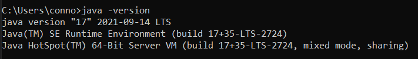
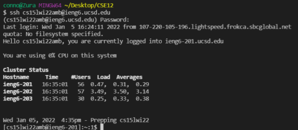
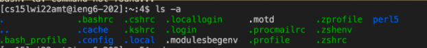
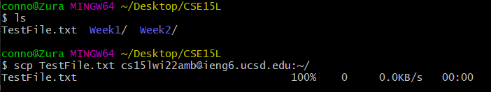
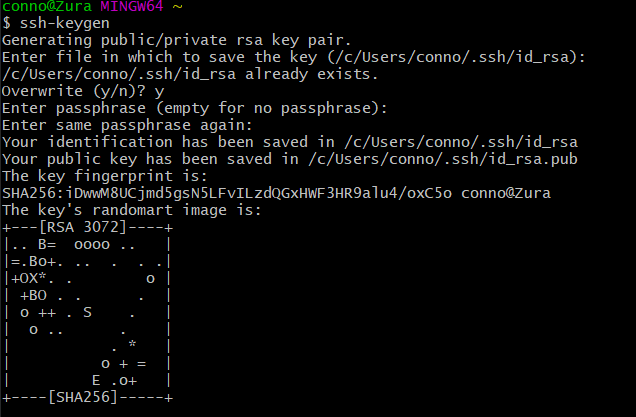
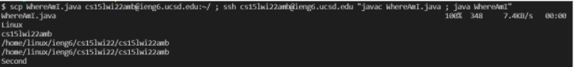

# Lab Report 1
Description: learning how to access the UCSD lab remote desktops through SSH

---

## Installing VSCode
Installing Visual Studio Code was something that I did for a previous class but I'll just quickly run through the process that I did at that time. 

You can install VSCode from [this link.](https://code.visualstudio.com/)

The VSCode download and installer is fairly simple. The only real difficulty came with making sure that java was installed properly. To do this all you have to do is go into the the command console and run 

$java -version



If it says 
```
java version "##"
```
 then java is installed properly. Java 8 or higher should be up to date enough for our purposes. If this does not appear, then you would have to install java and modify the system environment path variable.

---

## Remotely Connecting

Aside from the password pains, logging in through the ssh to the remote computer wasn't too difficult. By entering 
```
ssh cs15lwi22amb@ieng6.ucsd.edu
```
(the 3 characters after wi22 varies person to person) and inputting a password we get logged in. This simply allows us to access the remote desktop through our terminal



## Trying Some Commands

List of some commands we used and their use

- ls: lists the files and folders in the current directory
- ls -a: lists all files and folders including the hidden ones in current directory
- ls -l: gives a long description of all files and folders in the current directory
- pwd: gives the directory path of the current directory
- cd *directory*: changes the directory to the specified directory
- mkdir *new folder*: creates a new folder in the current directory with specified name
- mv *file* *folder*: moves secified file in the directory to the specified folder in the directory
- rm *file*: removes/deletes specified file

ssh commands
- ssh *remote id*: connects to the computer with the specified id
- scp *file* *remote id + directory*: copies specified file to the remote computer in specified directory



## Moving files with `scp`

In order to run files on the remote computer, we must copy the file from our system to the remote system. To do this we run the command

`scp *file* cs15lwi22amb@ieng6.ucsd.edu:~/`

again the 3 characters following the wi22 will vary from person to person.



By logging in through `ssh` and using the `ls` command we can indeed see that the file has been copied into the remote computer.

## Setting an SSH Key

We create an SSH key in order to skip the step of inputting our password whenever using the `SSH` or `SCP` command. This saves us time.

In order to create the keys, we need to run the command 
```
ssh-keygen
``` 
on our client pc terminal. The default file locations and passphrase work fine. This will create the necessary key files. Once the files are created, log in to the remote server using `ssh` login and create a .ssh folder using the command 
```
mkdir .ssh
```
Once that has been done, log out and use the `scp` command to copy the id_rsa.pub file (the public key) in the .ssh folder created when making the keys on the client pc to the server's .ssh folder. This is done with the command 
```
scp /Users/conno/.ssh/id_rsa.pub cs15lwi22amb@ieng6.ucsd.edu:~/.ssh/authorized_keys
```

note: *the user and 3 characters following wi22 should be different.*

Once done, the password step should be bypassed for future uses of `ssh` and `scp`.



## Optimizing Remote Running

Here we just wanted to try to find ways to speed up the process of running our programs faster through the remote system. 

The most useful command I found was a command that copied our java program to the remote system, compiled the program on the remote system, and ran the program on the remote system. 

```
$scp WhereAmI.java cs15lwi22amb@ieng6.ucsd.edu:~/ ; ssh cs15lwi22amb@ieng6.ucsd.edu "javac WhereAmI.java ; java WhereAmI"
```



If I were to be making changes to the program, I could simply save the file, the use the up arrow in my terminal and it would copy, compile, and run the program to the remote system all in one command. 


code of WhereAmI.java
```
class WhereAmI {
    public static void main(String[] args) {
      System.out.println(System.getProperty("os.name"));
      System.out.println(System.getProperty("user.name"));
      System.out.println(System.getProperty("user.home"));
      System.out.println(System.getProperty("user.dir"));
      System.out.println("Second");
    }
  }
```