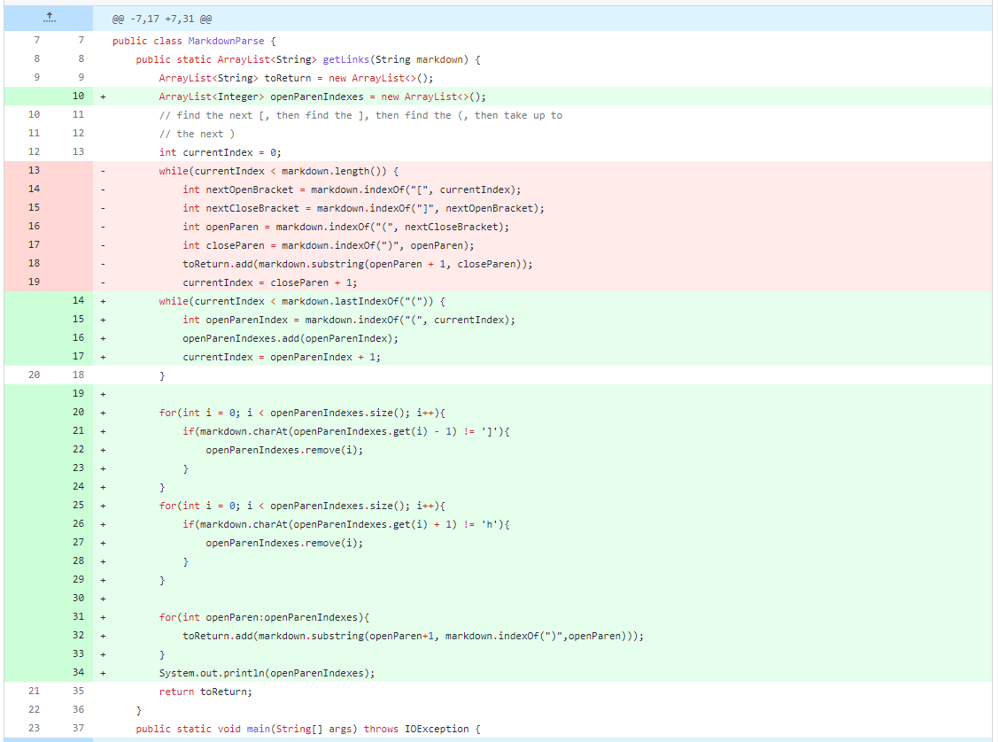
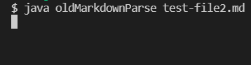
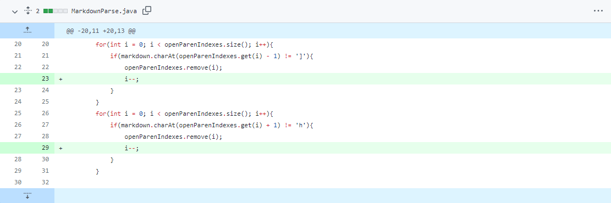
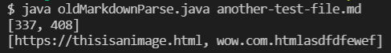
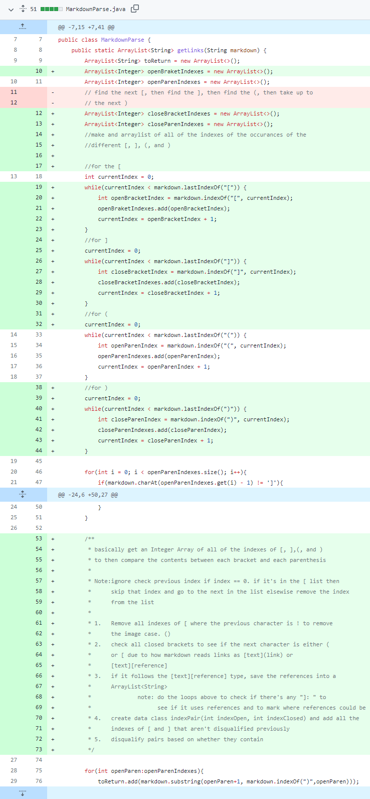
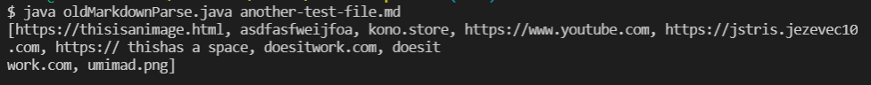

# Lab Report 2

In this lab, we started to modify the starter code of MarkdownParse.java that was provided to us. We were to modify/rewrite the code so it would more successfully achieve the goal of `creating a list of all of the links found in a markdown file`

NOTE
- We did not fork off of one person's repository in our lab section so I will be borrowing changes from my own repository and the changes I went through

## Change \#1


[Old code's failed test](https://github.com/Stocktocon/markdown-parse/blob/main/test-file2.md)
preview:
```
# Title

[a link!](https://something.com)
[another link!](some-page.html)

some paragraph text after the links
```
**Symptom:** Gets stuck in an infinite loop


This infinite loop was caused by lines 13 and 19 in the old code. Due to using a while loop using `currentIndex` and updating `currentIndex` with

```
currentIndex = openParenIndex + 1;
```
current index gets stuck in an infinite loop where it never satisfies the conditional of 
```
currentIndex < markdown.length()
```

Due to this and many other problem, I decided to take a completely different approach in finding the links by scrolling through the entire file first to find index of the `(` character and set the while loop to end at the last index of the `(` character in the file which avoids the infinite loop problem.

## Change \#2


[Old code's failed test](https://github.com/Stocktocon/markdown-parse/commit/c0e176d73cad7f81b5e30e73e8a15d415eb317dd#diff-7ddd1b4095b5e267db7de4ebc101890e5f54dc232ec81adeca17b852df0ed339)
preview: (the \`\`\` was changed to \`\`' to not mess with the formating of this page)
```
Hello I am writing text and I'm going to use brakets and parenthesis somewhat randomly in a way that I would normally write it.

here is random example of code 
``'
public static void main(String[]){
    int[] something = {1, 2, 3, 4};
    System.out.println(something);
}
``'

and now here is an actual image link
[real link](https://thisisanimage.html)
[[waiejfoapeoijfalsdkfj](asdfasfweijfoa)](wow.com.htmlasdfdfewef)

yo idk what I'm doing (and this is just some more random parenthsis for stuff)
and this has no real point in things.

ummmmmmmmm....
things and stuff woooooooo
```
**Symptom:** 

While this actually has the output for the method that we would actually expect, at the time it's not what I was expecting due to the way I looked for `](` in the file. I believed that it should have also included the `asdfasfweijfoa` as well inside the output list since I created that specific part to target that part of my code. 

## Change \#3


[Old code's failed test](https://raw.githubusercontent.com/Stocktocon/markdown-parse/main/another-test-file.md)
*this one is links to the raw because I really tried to push the boundries of what markdown files can consider as a link and my goal with the markdownparse.java will be reflecting the result given on github pages*

**Symptom:** 

Now that I've gotten the the code to return the test that didn't fail when it should have to properly fail, I started making plans to encorporate all possible fail cases I could possibly think of. One of the fail cases were `[]()` formated text inside the brackets since it reads both inner parenthesis seen by the `asdfasfweijfoa` failed test. The return including `umimad.png` shows that it also fails to differentiate between images and links since they have a similar syntax in markdown files. My program fails to check if there is an `!` before the brackets to verify that the syntax outlines a link instead of an image. These parts of my changes do no currently change how the program functions in terms of sending a return but it starts and outlines the plans I have to improve this program. The program also still has no infrastructure to include the reference style syntax for links.