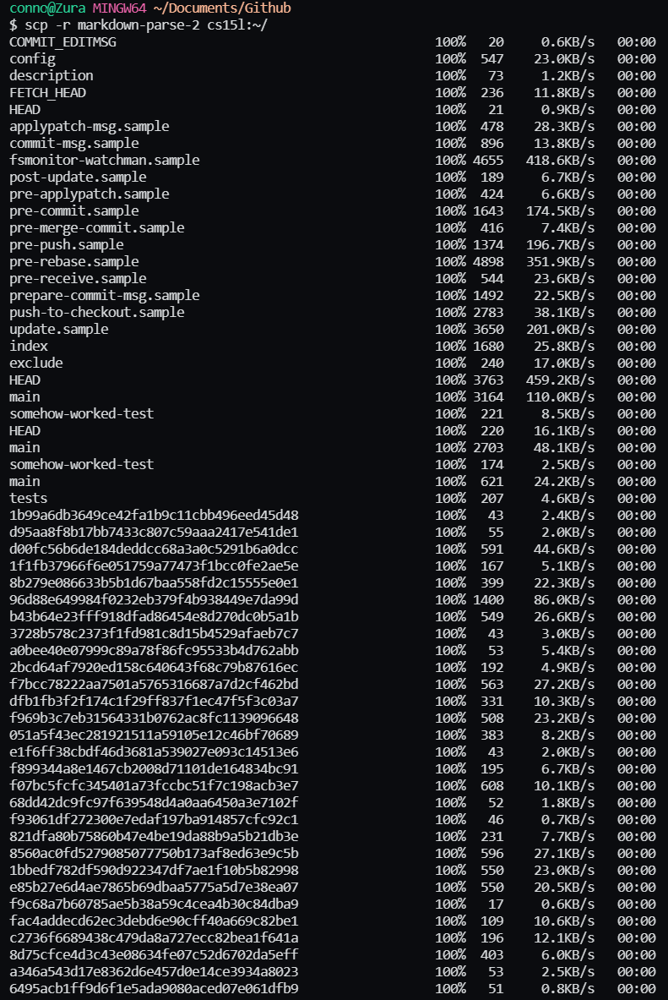

# Lab Report 3

The goal of this lab was to increase the ease of using github and the ssh server access.

---

## SSH Configuration

For this part, we just wanted to make it easier to log into the lab computers with ssh. In a previous lab, we made it easier to log into SSH by creating an ssh key for the two computers to contain allowing us to bypass the password. For this part of the lab, our goal is to make logging in even easier. To do this, we can go into the ssh config file and configure a custom user setting to log into the remote server. Previously to log into SSH, I would have to type:
```
ssh cs15lwi22amb@ieng6.ucsd.edu
```

By creating a file named `config` in the `.ssh` folder and using a text editing software, we give it the contents: 


The `HostName` represents the id typed after the `@` in the login while the `User` is the id before the `@`. 

Commands done previously to connect to the `ssh` server work similarly with this new host name. An example using `scp` is given below.


## GitHub Acess from ieng6

Our goal here is to gain access to Github from our ieng6 accounts, meaning through `SSH`.

### **Setting up ssh keys for github**

similar to in lab report 1, we have to run this command once again. This time do it while on the `ieng6` account. 

```
ssh-keygen
```

This time it might be useful give it a different name. To do this, just type a name


Now in order to put this on Github, we're goig to want the text contents of the public key. For this, since we cannot access the file contents of things in the ieng6 server, *yet*, we're going to want to copy it over to our local computer. To do this it's similar to copying files over from the local computer to the ieng6 server except you give the first argument as the file in ieng6 and the second argument is the directory we want to copy it to our local computer. For this example I copied it over to the Desktop.


We can open the file in VSCode or any other text editor and the contents of mine happens to be 

```
ssh-ed25519 AA3zClZD1NE5AAIQRoYYQL8E4AQ15tK9dW5ANr+p stocktocon@gmail.com
```
*I had just removed some characters from the text to not have the contents on the page.*

To add it on to Github, go into settings and there is a subsection of `SSH and GPG keys` and then you can just press the green `New SSH key`. Under `Title`, give it a name that you'd recognize and copy and paste the file contents of the public ssh key file into the `Key` text edit field. 


Once here, you should be good to go (almost but I'll get to that in a bit). You can now pull things from Github. Log back into ieng6 and try to run a `git` command, say 

```
git clone *some github repository*
```


If an error like the one above appears, then you would need to initialize an `ssh-agent` and add the key to the agent. This can be done automatically but I've yet to configure it myself yet. Once I do this myself, you can find my guide to it [here]().

to set up the ssh-agent run these commands

```
$ eval `ssh-agent`
$ ssh-add .ssh/id_ed25519 *or the file directory of the private key added to github*
```


Now git commands should work through the ieng6 computer.

I'll just show that it works properly by adding a file called `added_from_ieng6.txt` in from ieng6 into the lab report repository.


## Copying full directories with `scp -r`

When trying to test our code, it's useful to be able to copy the entire directory containing all of the files into ieng6. 

To do that, we could just do the same thing as before with scp but using the additional argument `-r` and instead of a file name, you could do a repository. Together it should look like this

```
$ scp -r /local/dir ieng6:~/server/dir
```


Here you can see it copying all of the files from markdown parse into ieng6. 



Now that our code is in ieng6, we can use the commands

```
javac -cp .:lib/junit-4.13.2.jar:lib/hamcrest-core-1.3.jar MarkdownParseTest.java

java -cp .:lib/junit-4.13.2.jar:lib/hamcrest-core-1.3.jar org.junit.runner.JUnitCore MarkdownParseTest
```

to compile and run markdown parse's testers from ieng6. 


Similar to what we did in lab report 1, we could also do all of this in one command by doing:

```
scp -r /local/dir ieng6:~/server/dir; ssh ieng6 "cd server/dir; javac -cp .:lib/junit-4.13.2.jar:lib/hamcrest-core-1.3.jar MarkdownParseTest.java; java -cp .:lib/junit-4.13.2.jar:lib/hamcrest-core-1.3.jar org.junit.runner.JUnitCore MarkdownParseTest"
```


note: The tester was removed due to a compile error when trying to run the testers in this way (appears when trying to use JUnit from vscode directly as well but it didn't appear when doing the command line compile and running so I have no real idea what the error is) You can find the image of the error [here](https://media.discordapp.net/attachments/671205412074422312/941773576971878430/unknown.png?width=521&height=936). I just get a problem where it says that the files don't exist when they clearly do and I have no idea why this happens so I'll just leave it here for now.