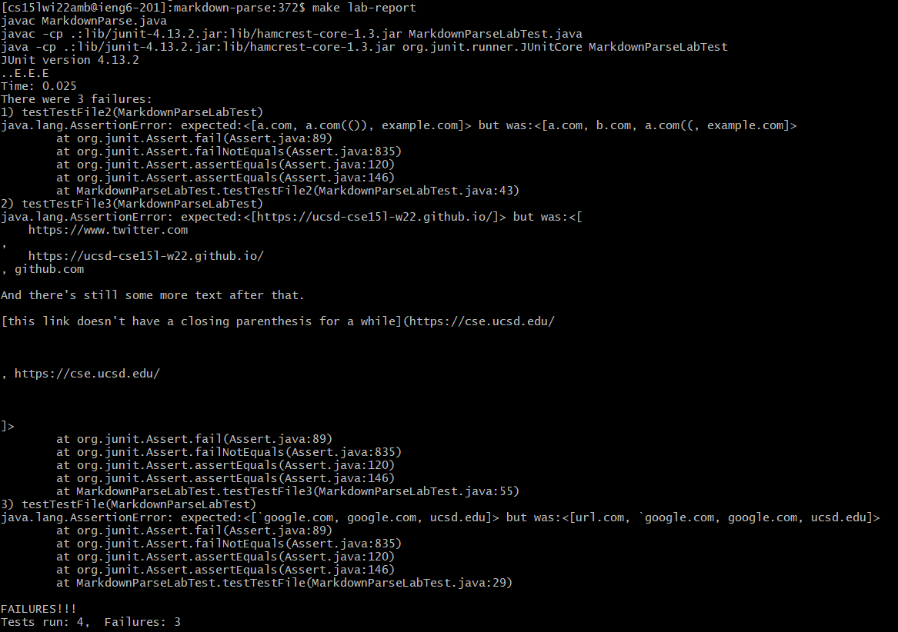
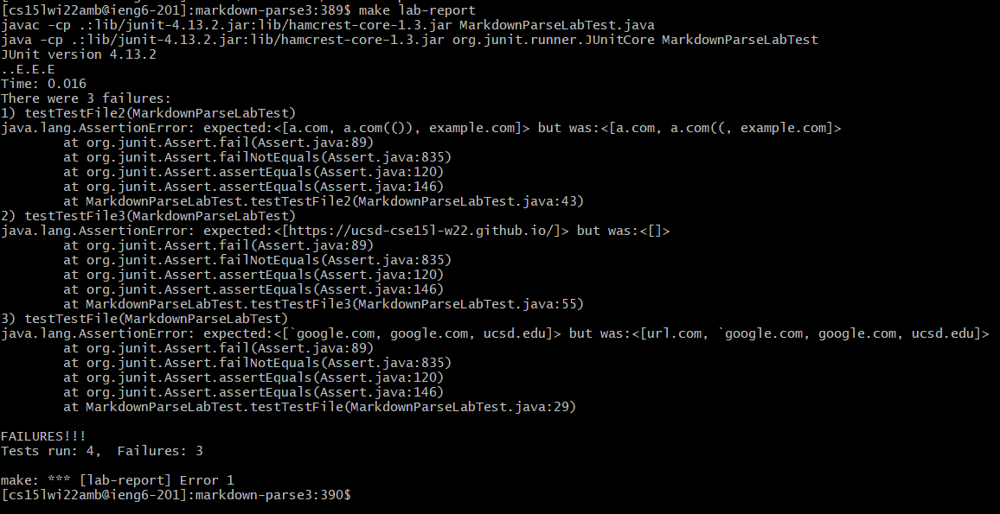

# Lab Report 4

For this lab, we were comparing our code to another group's code. Here's the link to [our code](https://github.com/Stocktocon/markdown-parse) and to [their code](https://github.com/PierreBeur/markdown-parse). 

we were given a few tests which you can find [here](https://ucsd-cse15l-w22.github.io/week/week8/#week-8-lab-report) to run on both our own code and the other group's code. 

## Our Code

Here's the tests running on our code:



As you might see, our code failed all three tests. 

For the first test file, our code failed to properly pair the \` characters to remove them as a possible link. I believe the way that the \` character is processed is that if it appears before the ( or [ it will prioritize the \` pairing but if the [ or ( appears before the \` then it will prioritize the grouping symbol. 

For the second test file, our code fails to account for nested groupings of grouping symbols. The file will prioritize the the group in the outermost grouping. Really, the first test in the second file is actually a bit different on Github Pages compared to the VSCode preview and the commonmark website's version of the website parser. In github, it gives the outermost link group while for the preview and commonmark it gives the inner link. 

For the third test file, our code fails to account for a `\n` character in the file. This one is fairly simple in how it works. If it's just one `\n` then it doesn't eliminate the link and just ignores that `\n` character and prints the link as if there were no `\n`. However, if it's a `\n\n` series of characters then it will eliminate the link. 

## Other Group's Code

Here's the tests running on the other group's code:



Again all three test files failed. For the first and second file, they fail for a similar reason as our code failed, however for the third code they failed for a different reason. In their code they elimate groupings that contain any form of a space within the () and for the last test case it sees the first ( then it never recognizes that there was a `\n` so it finds the next ) being the very last one and it sees the spaces in between all of those.

## How can the problems be fixed?

### Our code:

for our code, if we create the fixes in the way that I originally intended to create them, then no it would not be an easy fix. My intended path of operations is pairing each set of brackets and parenthesis then checking the contents inside those pairs to elimate them. That would require a method that pairs the grouping symbols and then create a series of if statements for each type of grouping that has the set of elimination categories that might occur. 

For the first file, the check would be to check if there is a \` on the same line before a [ or ( character. If there is, we would find the next index of a \` character before a new line character. Based on my planned implementation, we would then elimanate that pair.

For the second file, my planned form of grouping would result in the fix. However it's not an easy implementation.

For the third file, once we have the implementation of the grouping symbol pairing, we would run a pair.contains("\n\n") then we would eliminate the pair from the list which would result in the fix. 

### Their code:

While I don't know exactly what their author had in mind when programming I'll try my best to see what they need to fix.

To fix the last test, they could just add an 

```
25      if (!link.contains(" ")||!link.contains("\n\n")) {
```

to their code on line 25. That would eliminate the problems where the parenthesis contain it but doesn't cover the part for the brackets since they have no way to check for the contents in the brackets so they would have to modify their code completely to encoorperate that. 

That problem occurs for the first test as well with the \` character. For the \` cases, there would also have to be a major change to check if there's a \` containing the [ character. Again, since their test has no way to account for the [ character then it would require the major change to their code to account for the opening bracket.

For the second test file, it also wouldn't be a simple fix since they'd need to implement a way to detect and accommadate for the nested (). All of the things that aren't simple fixes just requires completely different and new implelentations. 