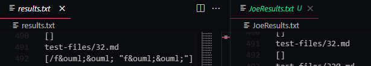
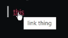
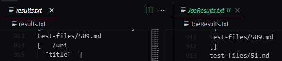
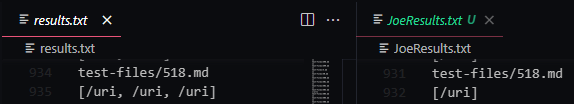

# Lab Report 5 (LAST ONE ALREADY!!!)

## Difference 1



There was a difference between the results from test file 32.md. The text in the file is as follows

```
[foo](/f&ouml;&ouml; "f&ouml;&ouml;")
```

and the VSCode preview produces a link that leads to `föö` as the output. This means that it's a bug in both programs. This has to do with the translation from the markdown format to the html format, since those ö characters aren't typically used so it has a translation for the `&ouml;` series of character to the &ouml; character. Joe's Markdown Parse implementation also eliminates all links that contain a space, resulting in no link being printed. For mine code, it just doesn't do the translation since there was no elimination for the any space characters. This format for a link seems to a special case that isn't accounted for based on the html translation of characters. Through a bit more testing using 

[this](hello "link thing")

which has 

```
[this](hello "link thing")
```
Hovering over the link preview the contents of the quotations while the actual link is the part not in quotations, as seen by the following

 

That would mean that the link pulled would have to be that part not contained in the quotation. The way to fix this would be to pull out anything inside of quotations and find the link before the space between the link and the quotations.

The fix for this would be within the part to determines the eligibility of a line inside (the parenthesis). My code does not have this yet at all While Joe's does around line 75 but needs to be heavily modified with `if else` statements to give it 

## Difference 2



There is a bug in both codes again. It uses the same syntax as the previous failed test, meaning it has a space character inside it, but it also has a \n character as well. Joe's code actually elimates all uses of both of those characters while mine doesn't not even consider them. The way that the link is actually registered is that the case is eliminated if there are two back to back \n\n characters, meaning it's a fairly simple fix on Joe's code where you'd only need to change the
```
potentialLink.indexOf("\n") == -1
```
to
```
potentialLink.indexOf("\n\n") == -1
```
in line 75. 

After doing this, you just have to make sure to remove any \n character if it's alone. Doing this will fix it for Joe's code with the exception of different syntax mentioned in the previous section. For my code, simliar fixes to Joe's code should be made, once the implementation for sensing what's inside the parenthesis is implemented. 

## Difference 3



Both of these have a bug. I believe the `/` character is actually used to designate the the link as a child directory in the current webpage url so an implementation for that needs to be added. Clicking on these links actually 